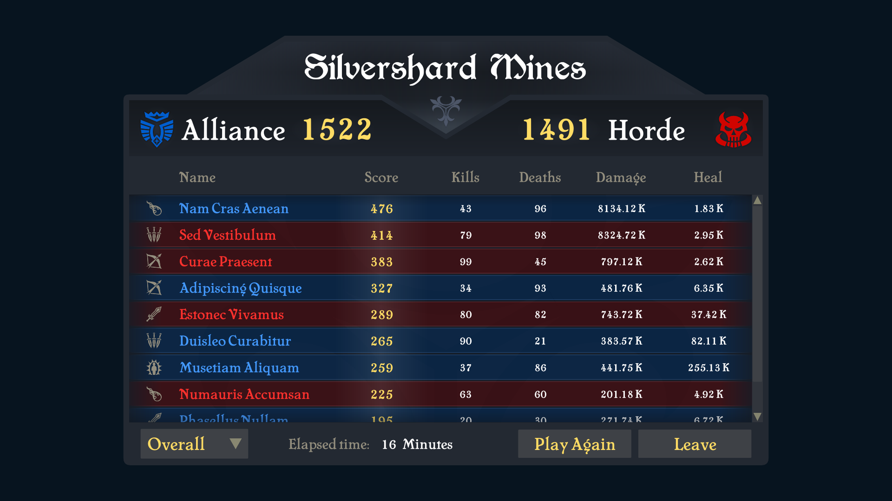

# noesis_bevy

[](https://github.com/dead-money/noesis_bevy/actions/workflows/ci.yml)

A Bevy 0.18 plugin that renders [Noesis GUI](https://www.noesisengine.com/) interfaces inside your game. Noesis is a commercial UI engine that draws XAML, the markup language behind WPF and Unity's UI, so you can design menus, HUDs, and inventories in a real authoring tool and run them in Bevy. The plugin draws the UI on Bevy's own GPU and composites it into your frame.

It builds on the FFI crate [`noesis_runtime`](https://github.com/dead-money/noesis_runtime), which wraps the C++ SDK. All `unsafe` lives there; this crate has none (`forbid(unsafe_code)`).

Built for Dead Money's own games and mostly written by AI agents under human direction.

<p align="center">
  
</p>
<p align="center"><em>The Noesis Scoreboard sample, rendered live in a Bevy frame through noesis_bevy. Every value (the team scores, the per-player table, the team filter) flows in through the crate's safe binding bridges.</em></p>

## You need a Noesis license

This crate links against the [Noesis Native SDK](https://www.noesisengine.com/), commercial software we can't redistribute. Each developer buys their own copy (Indie tier or higher) and points `NOESIS_SDK_DIR` at the install; the build links against it from there.

This release targets **Noesis Native SDK 3.2.13** and is compiled against that version's headers, so a different SDK version may not link. Match it unless you've tested a newer one.

Set `NOESIS_LICENSE_NAME` and `NOESIS_LICENSE_KEY` to your credentials. Without them the UI runs for a while, then blanks out with a "Trial expired" message.

## Quick start

```toml
[dependencies]
bevy = "0.18"
noesis_bevy = { git = "https://github.com/dead-money/noesis_bevy" }
```

It is a git dependency, not a crates.io release, and it still links the Noesis SDK at build time. You need `NOESIS_SDK_DIR` set (see above) for it to compile.

```rust
use std::sync::Arc;
use bevy::prelude::*;
use noesis_bevy::{NoesisCamera, NoesisPlugin, NoesisView, XamlRegistry};

fn main() {
    App::new()
        .add_plugins(DefaultPlugins)
        .add_plugins(NoesisPlugin::default())
        .add_systems(Startup, setup)
        .run();
}

fn setup(mut commands: Commands, mut xaml: ResMut<XamlRegistry>) {
    // Register XAML by URI. You can also load it through the asset server as a
    // `XamlAsset`; the loader feeds these same bytes into the registry.
    xaml.insert("MainMenu.xaml", Arc::new(include_bytes!("MainMenu.xaml").to_vec()));

    // A view is a `NoesisView` component on a 2D camera. Noesis renders the
    // scene into an offscreen texture and composites it onto that camera.
    commands.spawn((
        Camera2d,
        NoesisCamera,
        NoesisView {
            xaml_uri: "MainMenu.xaml".to_string(),
            size: UVec2::new(1920, 1080),
            ..default()
        },
    ));
}
```

`NoesisPlugin::default()` reads `NOESIS_LICENSE_NAME` and `NOESIS_LICENSE_KEY` from the environment. Pass `NoesisLicense { name, key }` to set them explicitly.

## Driving the UI from systems

Each piece of UI state is a component on the view entity: text, visibility, data binding, list contents, and more. Add one when you spawn the view, then change it at runtime from any system. For an app with a single UI, `NoesisUi` finds that one view for you so a system doesn't have to spell out the query:

```rust
use bevy::prelude::*;
use noesis_bevy::{NoesisCamera, NoesisText, NoesisUi, NoesisView};

fn spawn(mut commands: Commands) {
    commands.spawn((
        Camera2d,
        NoesisCamera,
        NoesisView { xaml_uri: "Hud.xaml".into(), size: UVec2::new(1920, 1080), ..default() },
        // Seed initial text for named elements; applied once the scene builds.
        NoesisText::new().with("Score", "0").with("Lives", "3"),
    ));
}

fn update_score(score: Res<Score>, mut ui: NoesisUi<&mut NoesisText>) {
    if !score.is_changed() { return; }
    let Some(mut text) = ui.get_mut() else { return };
    text.write("Score", score.0.to_string()); // &mut self setter, no raw map access
}
```

`NoesisUi<&mut T>` reads or writes a bridge component `T` on the single view; plain `NoesisUi` just yields the view entity via `ui.entity()`, handy for matching the `view: Entity` that read-back messages carry. Its accessors return `None` (rather than skipping the system) when there is not exactly one view, so a multi-view app routes by that entity instead.

Components seeded before the scene exists are not lost: a freshly built (or hot-reloaded) scene re-applies the current state.

## The Scoreboard sample

```sh
cargo run --example scoreboard
```

The flagship example (pictured above): a faithful port of Noesis's own Scoreboard demo, driven entirely through the crate's safe bridges. It parses the SDK's real `MainWindow.xaml` byte for byte and feeds it with `NoesisVm` (the `Game` view model as `DataContext`), `NoesisItems` (the ten player rows and the team-filter combo), and `NoesisDp` (reading bound values back), with `NoesisWindowCompatPlugin` standing in for the sample's `<Window>` root. It reads the XAML and its fonts from `$NOESIS_SDK_DIR` at runtime (nothing vendored), so it needs that set and skips gracefully when unset. The data round-trip is covered by `tests/headless_example_scoreboard.rs`.

## The viewer example

`xaml_viewer` is a runnable demo with scene cycling, theme loading, and a screenshot harness:

```sh
# Cycle through assets/viewer_samples/*.xaml. [/] navigate, R reload, S screenshot, P toggle PPAA.
cargo run --example xaml_viewer

# A single XAML file
cargo run --example xaml_viewer -- path/to/scene.xaml

# A themed control gallery (loads the SDK's DarkBlue theme)
NOESIS_VIEWER_THEME=DarkBlue \
    cargo run --example xaml_viewer -- assets/Data/Styles.xaml

# A headless screenshot for CI
NOESIS_VIEWER_EXIT_AFTER=1 NOESIS_SCREENSHOT=/tmp/out.png NOESIS_SCREENSHOT_FRAMES=120 \
    cargo run --example xaml_viewer -- assets/viewer_samples/08_radial.xaml
```

Environment variables: `NOESIS_VIEWER_PATH`, `NOESIS_VIEWER_SIZE` (`WxH`), `NOESIS_VIEWER_THEME`, `NOESIS_VIEWER_IMAGES` (comma-separated asset paths to pre-load), `NOESIS_SCREENSHOT`, `NOESIS_SCREENSHOT_FRAMES`, `NOESIS_VIEWER_EXIT_AFTER`.

## Custom controls and markup extensions

Need a control the SDK doesn't ship, or your own `{Binding}`-style markup? Write it in Rust, register it from a `Startup` system, and XAML can then use it by name:

```rust
use bevy::prelude::*;
use noesis_bevy::classes::{
    ClassBase, ClassBuilder, NoesisClassRegistry, PropType,
    PropertyChangeHandler, PropertyValue, Instance,
};

struct NineSlicerHandler { source_idx: u32 /* ... */ }
impl PropertyChangeHandler for NineSlicerHandler {
    fn on_changed(&mut self, instance: Instance, idx: u32, value: PropertyValue<'_>) {
        // Recompute derived properties and write them back via instance.set_*().
    }
}

fn register(mut registry: ResMut<NoesisClassRegistry>) {
    let mut b = ClassBuilder::new("MyNs.NineSlicer", ClassBase::ContentControl,
                                  NineSlicerHandler { source_idx: 0 });
    b.add_property("Source", PropType::ImageSource);
    b.add_property("SliceThickness", PropType::Thickness);
    if let Some(reg) = b.register() { registry.add(reg); }
}
```

`MarkupExtensionRegistration` works the same way via `NoesisMarkupExtensionRegistry`. See the `noesis_runtime` README for the FFI-level details.

## Data binding

Bind a plain Bevy `Resource` to XAML `{Binding field_name}`: derive `NoesisViewModel`, register it, and each field is reflected to the binding engine by name, two-way.

```rust
use bevy::prelude::*;
use noesis_bevy::{NoesisPlugin, NoesisViewModel, NoesisViewModelAppExt};

#[derive(Resource, NoesisViewModel)]
struct SettingsVm {
    volume: f32,   // <Slider Value="{Binding volume, Mode=TwoWay}"/>
    muted: bool,   // <CheckBox IsChecked="{Binding muted}"/>
    quality: i32,  // <ComboBox SelectedIndex="{Binding quality, Mode=TwoWay}"/>
}

App::new()
    .add_plugins((DefaultPlugins, NoesisPlugin::default()))
    .insert_resource(SettingsVm { volume: 0.8, muted: false, quality: 2 })
    .add_noesis_view_model::<SettingsVm>(); // attach as the view-root DataContext
```

Mutating the resource updates the bound controls (Bevy change detection drives `INotifyPropertyChanged`); a control edit writes back into the resource. Supported field types are `f32`/`f64`, `i32`/`u32`, `bool`, and `String`; mark other fields `#[noesis(skip)]`.

When you need finer control, three lower-level bridges sit underneath: `NoesisVm` (a view model you build one property at a time), `NoesisItems` (fill a list or dropdown from a Rust collection), and `NoesisDp` (get, set, or watch any property on a named element directly, no binding required).

## How it works

- **The bridge pattern.** Each feature is a component you add to the view's camera entity. A system runs every frame, pushes that component's state into the live UI, and surfaces anything the UI reports back as a message tagged with the view it came from. `NoesisVm`, `NoesisItems`, `NoesisText`, and the rest all share this shape, so adding a feature means copying an existing bridge.
- **Noesis runs on the main thread.** Noesis is single-threaded, so its view, renderer, and device stay on Bevy's main thread, and the bridges run there too. Only the finished image is handed to the render thread, which keeps Bevy's normal multi-threaded rendering intact.
- **One texture, then a copy.** Each frame Noesis paints the UI into an offscreen texture sized to the scene, and a render-graph node copies that onto your camera's output with the right color handling.
- **No unsafe here.** This crate is `forbid(unsafe_code)`. All `unsafe` lives in `noesis_runtime` behind safe wrappers.
- **Transparency that doesn't fringe.** PNG and JPEG images are blended once when they load, so transparent edges stay clean instead of showing dark halos.
- **Fonts must load before the UI.** Noesis remembers a font folder the first time it looks inside, so if your fonts haven't loaded yet, text in them renders blank forever. List the folder in `NoesisView::wait_for_fonts` and the view waits for them before it builds.

## Setup

```sh
unzip NoesisGUI-NativeSDK-linux-3.2.13-Indie.zip -d ~/sdks/noesis-3.2.13
export NOESIS_SDK_DIR=~/sdks/noesis-3.2.13
export LD_LIBRARY_PATH=$NOESIS_SDK_DIR/Bin/linux_x86_64:$LD_LIBRARY_PATH
```

Symlink the SDK's font and data directories so the examples and `NOESIS_VIEWER_THEME` loader can find them (these `assets/` paths are gitignored):

```sh
ln -sfn $NOESIS_SDK_DIR/Data/Fonts assets/Fonts
ln -sfn $NOESIS_SDK_DIR/Data        assets/Data
```

Apply your Noesis credentials so the runtime runs licensed:

```sh
export NOESIS_LICENSE_NAME=...
export NOESIS_LICENSE_KEY=...
```

Then build and run:

```sh
cargo test
cargo run --example xaml_viewer
```

## Licensing

Source in this repository is © 2026 Dead Money under the [MIT License](./LICENSE). Everything under `src/`, `tests/`, `examples/`, and `assets/` is original work; no Noesis SDK code is vendored.

The Noesis Native SDK is not redistributed here. You obtain it from Noesis Technologies under their EULA, and `noesis_runtime`'s `build.rs` links it from `NOESIS_SDK_DIR` at compile time. Use and distribution of binaries you build that link the SDK are governed by the Noesis EULA, not by the MIT License above.

## Acknowledgements

Built on [Bevy](https://bevy.org/) and the [Noesis](https://www.noesisengine.com/) Native SDK. The upstream docs at [docs.noesisengine.com](https://docs.noesisengine.com/) are the source of truth for XAML, control templates, and binding behavior. Report SDK bugs there; report integration bugs here.
</content>
</invoke>
