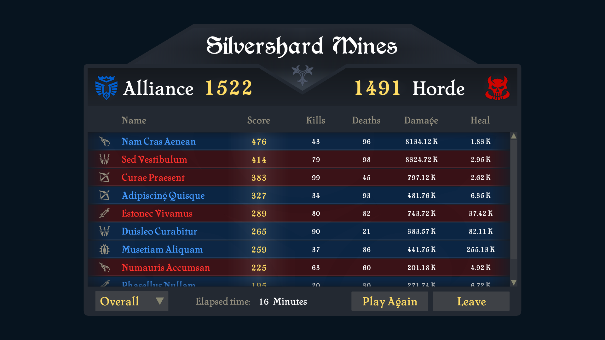

# noesis_bevy

[](https://github.com/dead-money/noesis_bevy/actions/workflows/ci.yml)
[](https://crates.io/crates/noesis_bevy)
[](https://docs.rs/noesis_bevy)

A Bevy 0.19 plugin that renders [Noesis GUI](https://www.noesisengine.com/) XAML-driven UI into your frame. Noesis draws the scene on Bevy's own GPU; the plugin composites the result onto a camera.

It builds on the FFI crate [`noesis_runtime`](https://github.com/dead-money/noesis_runtime), which wraps the C++ SDK, and draws through the render device in [`noesis_wgpu`](https://github.com/dead-money/noesis_wgpu). All `unsafe` lives in `noesis_runtime`. This crate has none of its own and sets `#![forbid(unsafe_code)]`.

Built for Dead Money's own games and mostly written by AI agents under human direction.

<p align="center">
  
</p>
<p align="center"><em>The Noesis Scoreboard sample, rendered live in a Bevy frame through noesis_bevy. Every value (the team scores, the per-player table, the team filter) flows in through the crate's binding bridges.</em></p>

## You need a Noesis license

This crate links against the [Noesis Native SDK](https://www.noesisengine.com/), closed-source commercial software we don't redistribute. Buy it separately (Indie tier or higher) and point `NOESIS_SDK_DIR` at your install; the build links against it from there.

This release targets **Noesis Native SDK 3.2.13** and is compiled against that version's headers, so a different SDK version may not link. Match it unless you've verified a newer one.

Supported targets are Linux (`x86_64`, `aarch64`) and Windows (`x86_64-pc-windows-msvc`). Linux is the primary target; Windows builds but isn't covered by CI.

Set `NOESIS_LICENSE_NAME` and `NOESIS_LICENSE_KEY` to apply your license. Without them the UI runs for a while, then blanks the view with a "Trial expired" message.

## Quick start

```toml
[dependencies]
bevy = "0.19"
noesis_bevy = "0.15"
```

It links the Noesis SDK at build time, so you need `NOESIS_SDK_DIR` set (see above) to compile.

```rust
use std::sync::Arc;
use bevy::prelude::*;
use noesis_bevy::{NoesisCamera, NoesisPlugin, NoesisView, XamlRegistry};

const MENU_XAML: &str = r#"<Grid xmlns="http://schemas.microsoft.com/winfx/2006/xaml/presentation">
  <TextBlock Text="Hello, Noesis!" Foreground="White"
             HorizontalAlignment="Center" VerticalAlignment="Center"/>
</Grid>"#;

fn main() {
    App::new()
        .add_plugins(DefaultPlugins)
        .add_plugins(NoesisPlugin::default())
        .add_systems(Startup, setup)
        .run();
}

fn setup(mut commands: Commands, mut xaml: ResMut<XamlRegistry>) {
    // Register XAML by URI. For real projects, load .xaml files through the
    // asset server instead; the loader feeds the same registry.
    xaml.insert("menu.xaml", Arc::new(MENU_XAML.as_bytes().to_vec()));

    // A view is a `NoesisView` on a camera. Noesis renders the scene offscreen
    // and composites it onto that camera. A Camera3d also needs `NoesisCamera`;
    // on a Camera2d the tag is optional.
    commands.spawn((
        Camera2d,
        NoesisCamera,
        NoesisView {
            xaml_uri: "menu.xaml".to_string(),
            size: UVec2::new(1920, 1080),
            ..default()
        },
    ));
}
```

`NoesisPlugin::default()` reads `NOESIS_LICENSE_NAME` and `NOESIS_LICENSE_KEY` from the environment. Pass `NoesisLicense { name, key }` to set them explicitly.

## How the UI fits Bevy

Bevy hosts Noesis as an embedded retained-mode GUI and renders its output. XAML owns structure and layout; the ECS supplies data and intent through a small set of typed bridges.

- The XAML tree lives inside Noesis. Noesis parses your XAML and owns the live controls, the visual and logical trees, dependency properties, styles, triggers, and animations. No control is a Bevy entity; there is no entity per `<Button>`.
- Each view is one entity: the `NoesisView` camera entity. It renders one XAML document, and the tree behind it is opaque to the ECS.
- You reach controls through bridges. Bridge components on the view entity name elements by `x:Name`, and reconcile systems in `NoesisSet::Apply` push values into the live scene and read values back: `NoesisText` for text, `NoesisDp` for dependency properties, `NoesisVm` for view models, `NoesisCommands` for commands, and so on. Read-backs arrive as messages carrying the `view` entity. Data binding, commands, and view models are the seam, as in WPF.
- You don't get per-widget `Transform`, picking, or change detection. Anything gameplay drives goes through a bridge.

The entity-driven API below builds on the bridges and makes panels and list rows into entities when you want plain ECS ergonomics.

## The entity-driven UI API

Three primitives make a Bevy entity the unit of UI. You still author the XAML, but you spawn entities and write ordinary systems instead of filling string-keyed bridges. `examples/ecs_ui.rs` runs all three.

**Panel = entity.** A `UiPanel` mounts a XAML fragment into a named `Panel` of a view's scene. The entity's bound components, registered with `add_noesis_panel_field`, form the fragment's `DataContext`:

```rust
#[derive(Component, NoesisViewModel, Clone, Copy)]
struct Health(f32);   // binds {Binding Health} inside the fragment

app.add_noesis_panel_field::<Health>();

commands.spawn((UiPanel::new("hud.xaml").mount_into(view, "Slot"), Health(100.0)));

fn regen(mut q: Query<&mut Health, With<UiPanel>>) {
    for mut h in &mut q { h.0 = (h.0 + 1.0).min(100.0); }
}
```

Two panels with the same components bind independently. A panel needs `mount_into`; without a host it never mounts. The bound components are fixed the first frame the panel reconciles, so spawn them in one bundle (or see `UiPanel::deferred_seal`). To show and hide an element, bind a `String` field to `Visibility` and set it to one of `visibility::{VISIBLE, COLLAPSED, HIDDEN}`.

**List = query.** A list is its own entity naming the view it renders into, and its rows are entities too. Point an entity at a list with `ListedIn` and it appears as a row. The bound collection is reconciled by `Entity`, so changing one component updates only its row and selection survives a reorder. One view can host any number of lists:

```rust
#[derive(Component, NoesisViewModel, Clone)]
struct Item { name: String, qty: i32 }

app.add_noesis_list::<Item>();

let list = commands.spawn(UiList::new(view, "Inventory")).id();
commands.spawn((Item { name: "Potion".into(), qty: 3 }, ListedIn(list)));
```

The selected row carries a `Selected` marker, read back with `Query<&Item, With<Selected>>`.

**Events = observers.** UI events arrive as `EntityEvent`s targeting the entity they came from. Clicking a list row raises `UiClicked` on the row entity. Clicks and key presses on elements named in a `NoesisClickWatch` / `NoesisKeyDownWatch` raise `UiClicked` / `UiKeyDown` on the panel or view carrying the watch. Events are delivered the frame after they fire, so the target may already be despawned; look it up with `get`:

```rust
fn use_item(on: On<UiClicked>, items: Query<&Item>) {
    if let Ok(item) = items.get(on.event_target()) {
        // the row the click came from
    }
}
```

## Driving the UI from systems

Each piece of UI state (text, visibility, list contents, and more) is a bridge component on the view entity. Spawning a `NoesisView` attaches every per-view bridge as a required component, empty by default, so you write to them without inserting them first. A write made in `Startup` or `OnEnter`, before the scene exists, lands once the scene builds. `NoesisVm` and `NoesisCommands` are not auto-attached; add them yourself, since they need a class or command name.

Most bridge maps are write-through: removing an entry leaves the element at its last value. To reset an element, write the value you want.

For an app with a single view, `NoesisUi` finds it for you so a system doesn't spell out the query:

```rust
use bevy::prelude::*;
use noesis_bevy::{NoesisText, NoesisUi};

fn update_score(score: Res<Score>, mut ui: NoesisUi<&mut NoesisText>) {
    if !score.is_changed() { return; }
    let Some(mut text) = ui.get_mut() else { return };
    text.write("Score", score.0.to_string());
}
```

`NoesisUi<&mut T>` reads or writes a bridge component `T` on the single view; plain `NoesisUi` yields the view entity via `ui.entity()`, which matches the `view: Entity` that read-back messages carry. Its accessors return `None` (rather than skipping the system) when there isn't exactly one view, so a multi-view app routes by that entity instead.

## Custom controls and markup extensions

Write a control or a `{Binding}`-style markup extension in Rust, register it from a `Startup` system before any XAML that uses it loads, and XAML can use it by name:

```rust
use bevy::prelude::*;
use noesis_bevy::classes::{
    ClassBase, ClassBuilder, NoesisClassRegistry, PropType,
    PropertyChangeHandler, PropertyValue, Instance,
};

struct NineSlicerHandler { source_idx: u32 /* ... */ }
impl PropertyChangeHandler for NineSlicerHandler {
    fn on_changed(&self, instance: Instance, idx: u32, value: PropertyValue<'_>) {
        // Recompute derived properties and write them back via instance.set_*().
    }
}

fn register(mut registry: NonSendMut<NoesisClassRegistry>) {
    let mut b = ClassBuilder::new("MyNs.NineSlicer", ClassBase::ContentControl,
                                  NineSlicerHandler { source_idx: 0 });
    b.add_property("Source", PropType::ImageSource);
    b.add_property("SliceThickness", PropType::Thickness);
    if let Some(reg) = b.register() { registry.add(reg); }
}
```

Handlers run on the main thread inside Noesis's property system while the crate holds its Noesis state borrowed, so they must not touch the Bevy `World`; queue ECS changes for a later system. `on_changed` takes `&self` because it can re-enter, so keep mutable state behind a `Cell`, `RefCell`, or `Mutex`. `MarkupExtensionRegistration` works the same way through `NonSendMut<NoesisMarkupExtensionRegistry>`. See the `noesis_runtime` docs for the FFI-level details.

## Data binding

Bind a plain struct to XAML `{Binding field_name}`: derive `Component` and `NoesisViewModel`, register the type, and insert it on the view entity. Each field binds by name, two-way.

```rust
use bevy::prelude::*;
use noesis_bevy::{NoesisPlugin, NoesisViewModel, NoesisViewModelAppExt};

#[derive(Component, NoesisViewModel)]
struct SettingsVm {
    volume: f32,   // <Slider Value="{Binding volume, Mode=TwoWay}"/>
    muted: bool,   // <CheckBox IsChecked="{Binding muted}"/>
    quality: i32,  // <ComboBox SelectedIndex="{Binding quality, Mode=TwoWay}"/>
}

App::new()
    .add_plugins((DefaultPlugins, NoesisPlugin::default()))
    .add_noesis_view_model::<SettingsVm>(); // binds as the view root's DataContext

// Then, on the view entity:
commands.entity(view).insert(SettingsVm { volume: 0.8, muted: false, quality: 2 });
```

Changing the component updates the bound controls; a `TwoWay` control edit writes back into the component on the next frame. Supported field types are `f32`/`f64`, `i32`/`u32`, `bool`, and `String`; mark other fields `#[noesis(skip)]`, or use `#[noesis(rename = "Name")]` to bind under a different name. Use `add_noesis_view_model_at` to bind to a named element instead of the root.

For finer control, three lower-level bridges sit underneath: `NoesisVm` (a view model built one property at a time), `NoesisItems` (fill a list or dropdown from a Rust collection), and `NoesisDp` (get, set, or watch any property on a named element directly, no binding required).

## Version compatibility

| Bevy | noesis_bevy |
|------|-------------|
| 0.19 | 0.13 – 0.15 |
| 0.18 | 0.10 – 0.12 |

Each Bevy minor gets a new `noesis_bevy` minor. The crate pins `wgpu` to the
version Bevy's renderer uses, and uses the `noesis_wgpu` line built on that
`wgpu` (0.1 for wgpu 29), so the render-device types are interchangeable.

## Setup

```sh
unzip NoesisGUI-NativeSDK-linux-3.2.13-Indie.zip -d ~/sdks/noesis-3.2.13
export NOESIS_SDK_DIR=~/sdks/noesis-3.2.13
export LD_LIBRARY_PATH=$NOESIS_SDK_DIR/Bin/linux_x86_64:$LD_LIBRARY_PATH
```

Symlink the SDK's font and data directories so the examples and the `NOESIS_VIEWER_THEME` loader can find them (these `assets/` paths are gitignored):

```sh
ln -sfn $NOESIS_SDK_DIR/Data/Fonts assets/Fonts
ln -sfn $NOESIS_SDK_DIR/Data        assets/Data
```

Apply your license credentials so the runtime runs licensed:

```sh
export NOESIS_LICENSE_NAME=...
export NOESIS_LICENSE_KEY=...
```

Then run the viewer and the tests. The integration tests need [cargo-nextest](https://nexte.st); see [`tests/README.md`](./tests/README.md).

```sh
cargo run --example xaml_viewer
cargo nextest run
```

## License

MIT; see [LICENSE](./LICENSE). No Noesis SDK code is included. Binaries that link the SDK are covered by the Noesis EULA.

## Acknowledgements

Built on [Bevy](https://bevy.org/) and the [Noesis](https://www.noesisengine.com/) Native SDK. The upstream docs at [docs.noesisengine.com](https://docs.noesisengine.com/) are the source of truth for XAML, control templates, and binding behavior. Report SDK bugs there; report integration bugs here.
